# ParkingApp User Guide

This guide explains how to use ParkingApp from the browser. It is written for everyday users and covers the three roles in the application:

- Employee
- Parking owner
- Administrator

Use the web address provided by your company administrator. In a local training setup, the application is usually opened at `http://localhost:8080`.

## 1. About ParkingApp

ParkingApp helps employees request available parking, parking owners offer their spots for a time window, and administrators manage people, teams, parking spots, assignments, and reports.

The normal flow is:

1. An administrator creates teams, users, and parking spots.
2. A parking owner publishes a parking offer for a time window.
3. Employees request the available spot.
4. The assignment process selects an employee and creates a reservation.
5. Employees and administrators review the reservation history.

## 2. Accessing The Application

Open ParkingApp in your browser and sign in with your username or email and password.

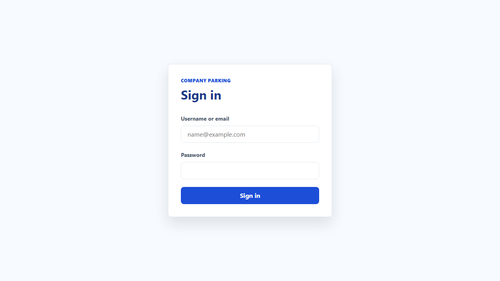

If sign-in succeeds, you will see the Dashboard. If sign-in fails, check the username or email and password and try again. The application shows `Invalid credentials.` when the username, email, or password is not accepted.

Do not share your password with another user. If you cannot sign in, contact your administrator.

## 3. General Navigation

The main navigation is role-specific. All signed-in users can see **Dashboard** and **Help**.

Employees also see **Available spots**, **My requests**, and **My reservations**. Parking owners see **Offer my spot**.

Administrators also see the Admin section:

- Admin dashboard
- Teams
- Users
- Parking spots
- Requests
- Reservations
- Audit logs
- Overrides
- Reports

The Dashboard gives quick links into the main areas for your role. Use **Help** for quick role-specific steps. On desktop, the sidebar can be collapsed or expanded; the application remembers your choice on the same browser.

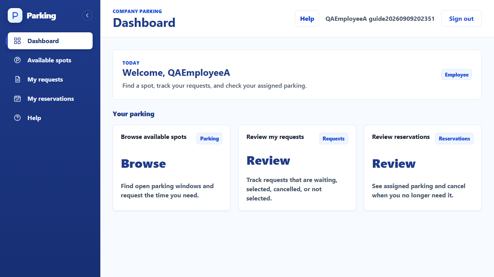

Use **Sign out** when you finish using the application, especially on a shared computer.

## 4. Employee Guide

Employees use ParkingApp to find available parking, request a spot, review their requests, and view or cancel active reservations.

### View Available Spots

Open **Available spots** to see parking offers that can still receive requests. Spot code, location, owner, time window, and team-priority end time are shown when available.

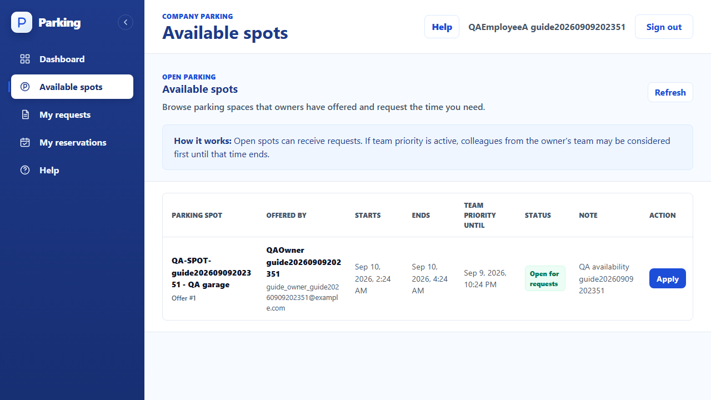

Choose **Apply** on the row you want. After submission, the button changes to **Requested** and the request appears in **My requests**.

Common situations:

- If you already requested that offer, the application shows `You already applied for this availability.`
- If the offer is no longer open, the application shows `This parking availability is no longer open.`

### Review My Requests

Open **My requests** to see the parking spot, requested time window, status, note, and request date. Technical request and offer references appear as secondary details for support.

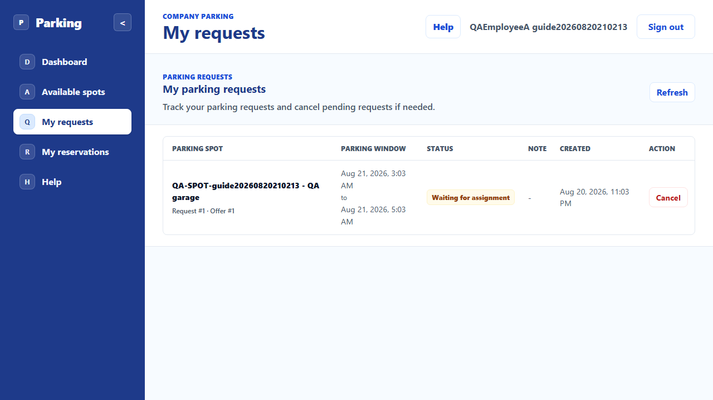

Request statuses shown in the interface:

- **Waiting for assignment**: your request has not been decided yet.
- **Selected**: your request received a reservation.
- **Cancelled**: your request was cancelled.
- **Not selected**: another request received the reservation.

Requests that are waiting for assignment can be cancelled from this screen.

### Review My Reservations

Open **My reservations** to see parking that has been assigned to you.

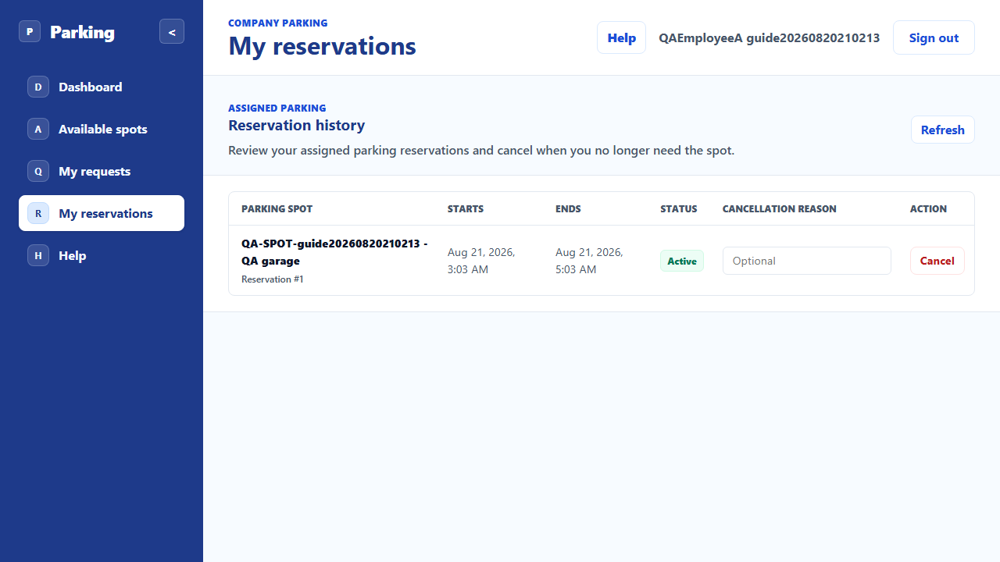

Reservation statuses:

- **Active**: the reservation is currently assigned to you.
- **Cancelled**: the reservation was cancelled.
- **Completed**: the reservation has ended or was completed.

If cancellation is available for an active reservation, enter a reason if needed and choose the cancel action. After cancellation, the reservation history remains visible.

## 5. Parking Owner Guide

Parking owners publish parking offers for spots assigned to them by an administrator.

The app loads active parking spots assigned to your account. If you have one active spot, it is shown and selected automatically. If you have more than one, choose the spot from the list.

### Offer A Parking Spot

Open **Offer my spot**, verify or select your assigned parking spot, enter the start time, end time, and an optional note, then choose **Publish offer**. You never need to type an internal parking spot ID.

If no active parking spot is shown, contact an administrator and ask them to review your parking spot assignment.

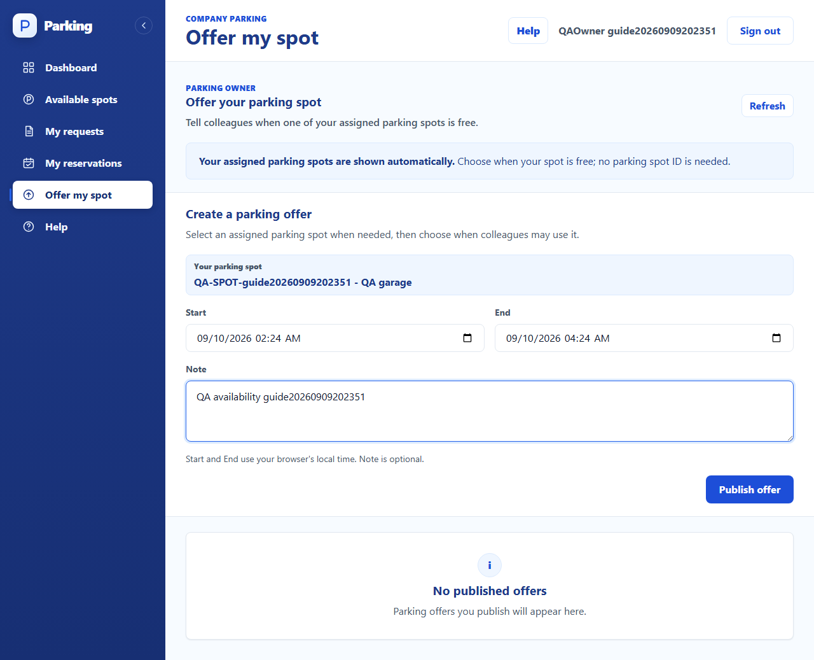

If the time range overlaps another availability for the same spot, the application shows `This time range overlaps another availability for the parking spot.`

### Review My Parking Offers

After publishing, the parking offer appears in your list with a friendly spot label and a secondary offer reference.

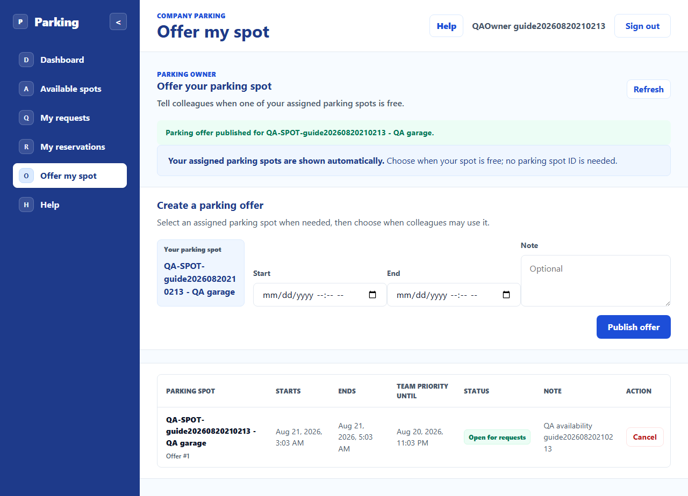

Parking offer statuses:

- **Open for requests**: employees can request the spot.
- **Assigned**: an employee has been assigned.
- **Cancelled**: the offer was cancelled.
- **Expired**: the offer was no longer usable before assignment.

The owner screen focuses on your published parking offers. It does not show full employee reservation details; contact an administrator if you need operational history.

## 6. Administrator Guide

Administrators manage setup data, review activity, perform controlled overrides, and export reports.

### Manage Teams

Open **Teams** to create or update teams.

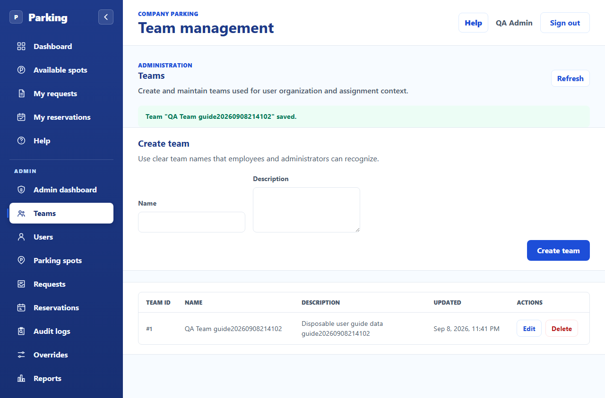

Teams help group employees and can influence assignment priority while the configured priority window is active.

### Manage Users

Open **Users** to create employee, parking owner, and administrator accounts.

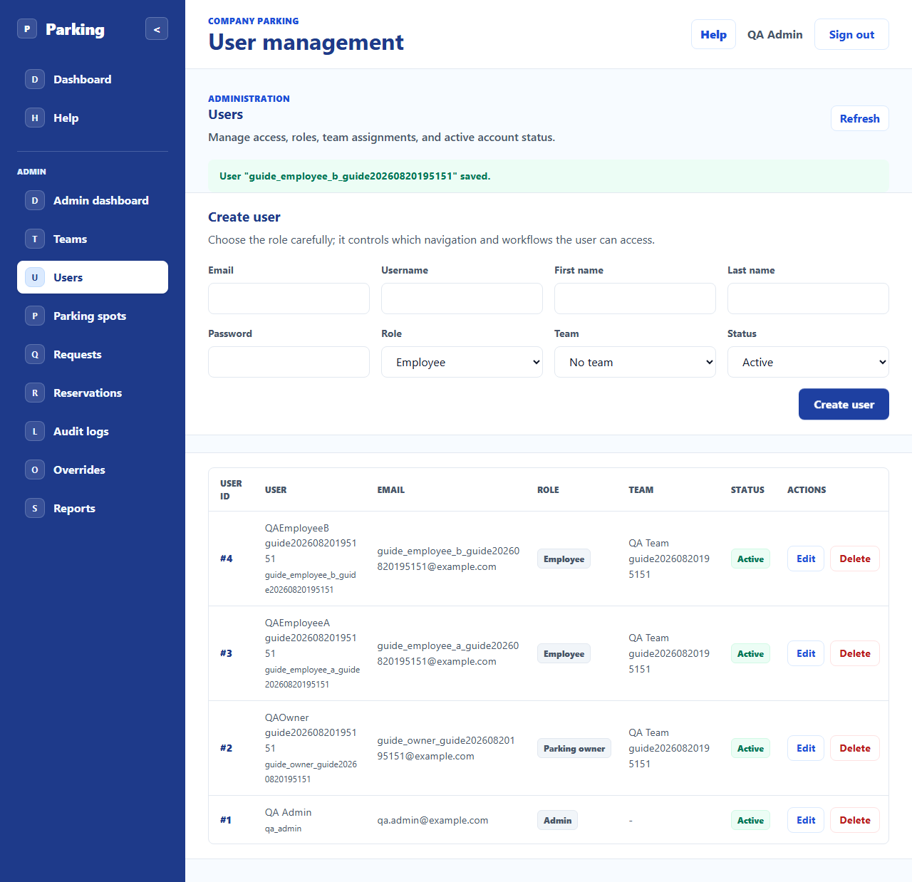

Choose the role carefully:

- `admin`: can manage setup, operations, overrides, audit logs, and reports.
- `employee`: can request parking and manage their own requests and reservations.
- `parking_owner`: can offer assigned parking spots.

Use active status for accounts that should be allowed to sign in. Inactive users cannot use the application.

### Manage Parking Spots

Open **Parking spots** to create parking spot records and assign an owner.

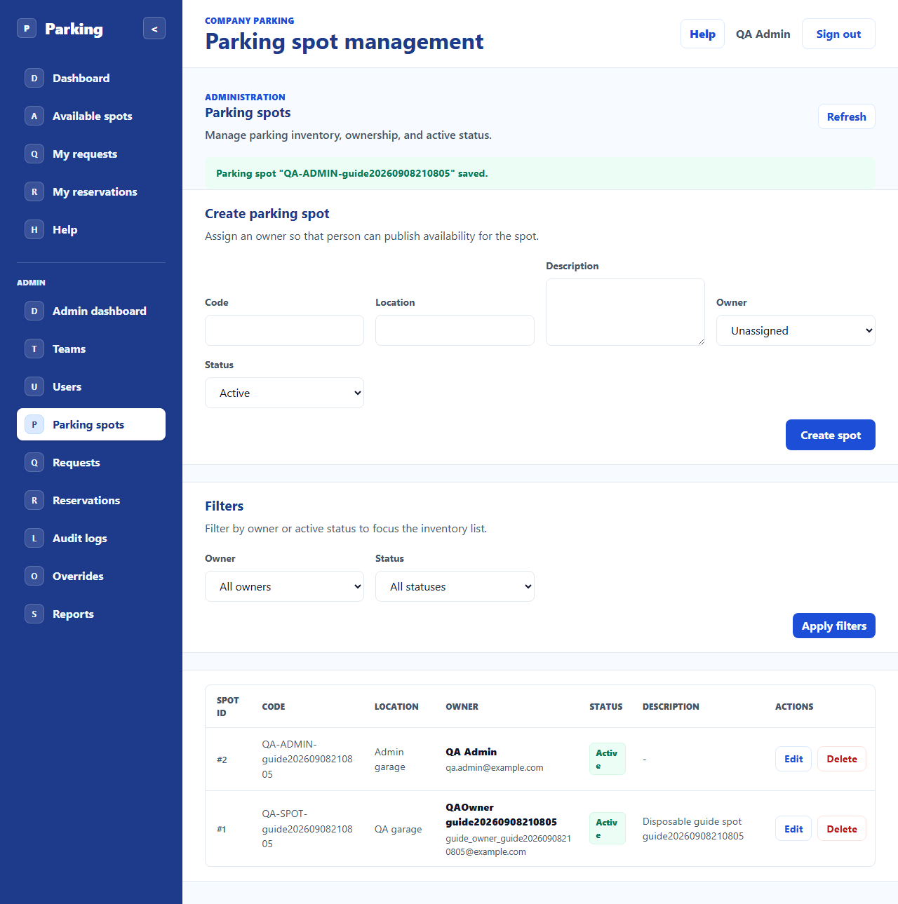

The owner sees assigned active spots automatically. Confirm the owner assignment and active status; do not ask the owner to enter a spot ID.

### Review Requests

Open **Requests** to review employee parking request activity.

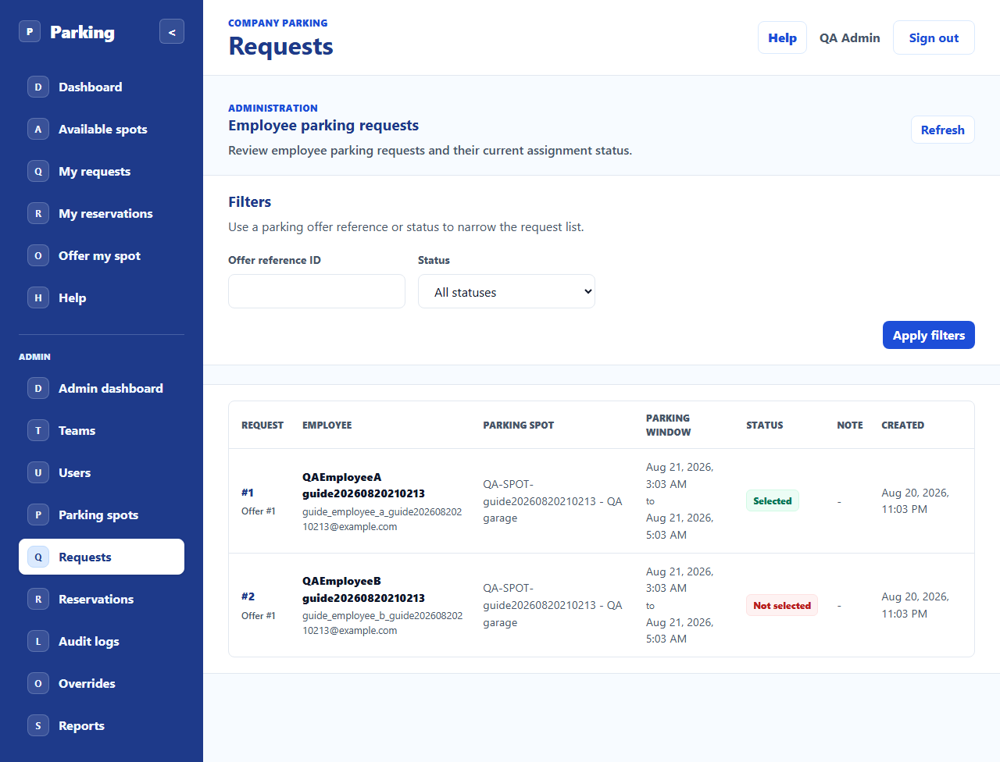

Use this screen to inspect employees, spot context, parking windows, statuses, notes, and timestamps. Request and offer references remain visible for manual overrides and support.

### Review Reservations

Open **Reservations** to review reservation history and current active assignments.

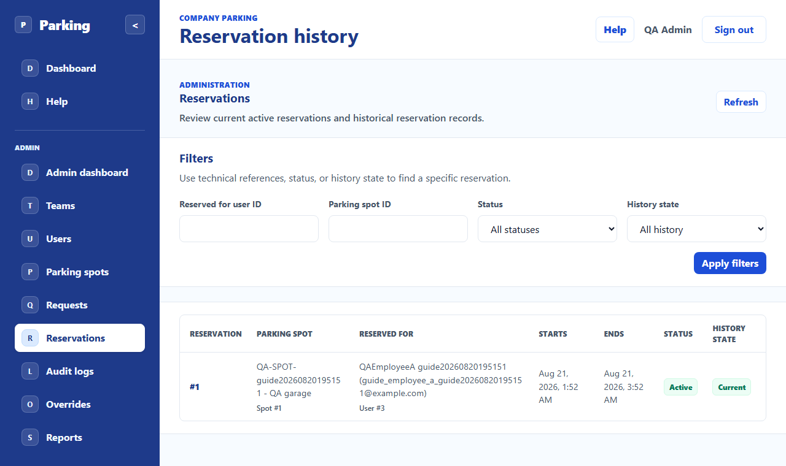

The browser Reservations screen is currently a history and review screen. Admin override actions are handled from **Overrides**.

### Use Overrides

Open **Overrides** when an administrator must manually assign or replace a reservation. A reason is required so the decision can be audited.

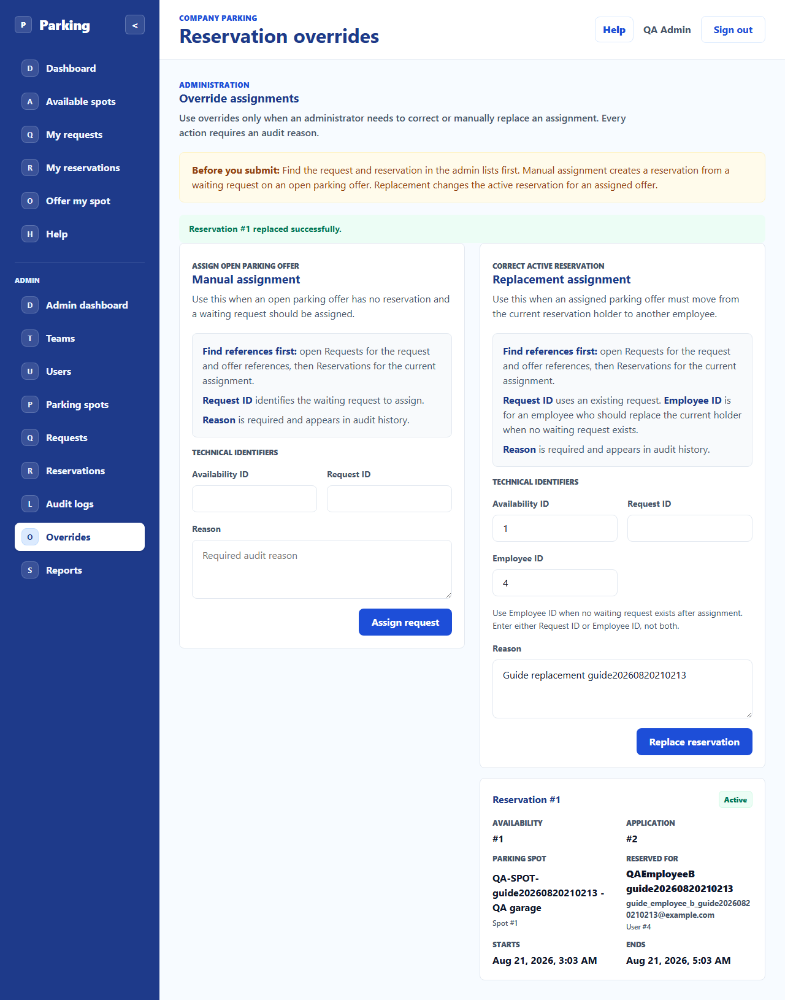

First find the relevant references in **Requests** and **Reservations**. For replacement assignments, provide either:

- Request ID, or
- Employee ID

Use only one of those fields for a replacement. If the reason is missing, the application shows `Reason is required.`

The mobile layout keeps the same controls available on a narrow screen.

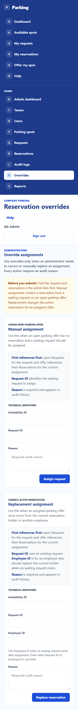

### Review Audit Logs

Open **Audit logs** to review assignment decisions and admin overrides.

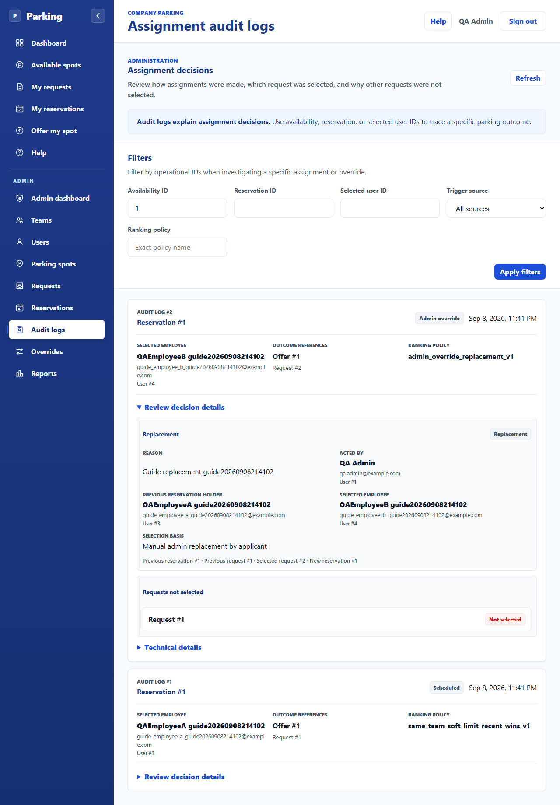

Audit logs are useful when checking why a reservation was created or changed.

### Review Reports And Exports

Open **Reports** to review operational summaries and export CSV files.

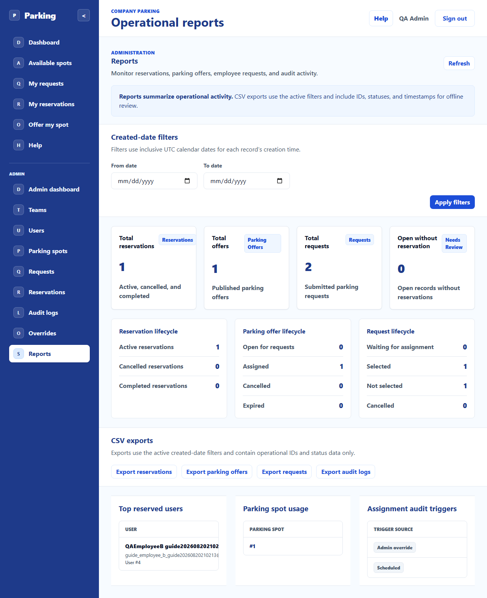

Available exports include:

- reservations
- availabilities
- applications
- audit logs

## 7. Status Reference

### Parking Offer Statuses

| Interface label | System status | Meaning |
| --- | --- | --- |
| **Open for requests** | `open` | Employees can request the spot. |
| **Assigned** | `assigned` | A reservation was created from this offer. |
| **Cancelled** | `cancelled` | The offer was cancelled. |
| **Expired** | `expired` | The offer expired before assignment. |

### Request Statuses

| Interface label | System status | Meaning |
| --- | --- | --- |
| **Waiting for assignment** | `pending` | The request is waiting for assignment. |
| **Selected** | `selected` | The request received a reservation. |
| **Cancelled** | `cancelled` | The request was cancelled. |
| **Not selected** | `rejected` | The request was not selected. |

### Reservation Statuses

| Interface label | System status | Meaning |
| --- | --- | --- |
| **Active** | `active` | The parking reservation is currently assigned. |
| **Cancelled** | `cancelled` | The parking reservation was cancelled. |
| **Completed** | `completed` | The parking reservation is completed. |

## 8. Common Messages And What They Mean

| Message | What to do |
| --- | --- |
| `Invalid credentials.` | Check the username or email and password, then try again. |
| `Your session has expired. Sign in again.` | Sign in again. |
| `You do not have permission to perform this action.` | Use an account with the required role or contact an administrator. |
| `You already applied for this availability.` | Review the existing request in **My requests**. |
| `This parking availability is no longer open.` | Choose a different available spot. |
| `This time range overlaps another availability for the parking spot.` | Choose a different time range. |
| `The selected applicant already has the active reservation.` | Choose another applicant or review the current reservation. |
| `Enter a reason for the reservation override.` | Add a clear reason before submitting the override. |
| `The parking record changed and the action could not be completed.` | Refresh the page and try again. |
| `Check the entered values and try again.` | Review required fields and values. |

If you contact support, include what you were trying to do, the date and time, your role, the page name, and any visible message. If a support person asks for a request ID and one is available, include it.

## 9. Troubleshooting

### I Cannot Sign In

Check that you are using the correct username or email. If the password is still not accepted, ask an administrator to check that your account is active.

### I Cannot See Admin Pages

Only administrators can access the Admin section. If you need administrator access, contact the person responsible for ParkingApp user management.

### I Cannot Publish Availability

Confirm that you are signed in as a parking owner and that your assigned active parking spot appears on **Offer my spot**. If no spot appears, ask an administrator to review the parking spot assignment and status.

### I Cannot Apply For A Spot

The parking offer may no longer be open, you may have already requested it, or the spot may have been assigned. Refresh **Available spots** and check **My requests**.

### My Reservation Disappeared From Active Reservations

The reservation may have been cancelled, completed, or replaced by an administrator. Check **My reservations** and contact an administrator if the history is unclear.

### A Page Looks Wrong On Mobile

Refresh the page first. If the issue remains, record the page name, your device or browser, and what looked wrong, then contact support.

## 10. Quick-Reference Workflows

### Employee Requests Parking

1. Sign in.
2. Open **Available spots**.
3. Choose **Apply** on an open parking offer.
4. Open **My requests** to confirm the request is listed.
5. Open **My reservations** after assignment to see the result.

### Parking Owner Offers A Spot

1. Sign in.
2. Open **Offer my spot**.
3. Verify the assigned spot shown by the app, or select one of your assigned spots.
4. Enter Start, End, and an optional Note.
5. Choose **Publish offer**.
6. Confirm the parking offer appears in the list.

### Administrator Sets Up A New Parking Flow

1. Open **Teams** and create the team.
2. Open **Users** and create the employee and parking owner.
3. Open **Parking spots** and assign a spot to the parking owner.
4. Ask the parking owner to publish a parking offer.
5. Review **Requests**, **Reservations**, **Audit logs**, and **Reports** as needed.

### Administrator Replaces A Reservation

1. Open **Requests** or **Reservations** to find the needed references.
2. Open **Overrides**.
3. Enter Availability ID.
4. Enter either Request ID or Employee ID.
5. Enter a reason.
6. Choose **Replace reservation**.
7. Check **Reservations** and **Audit logs**.
